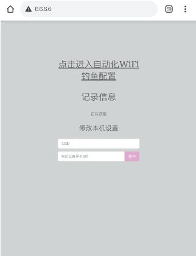
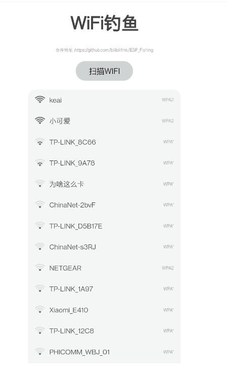
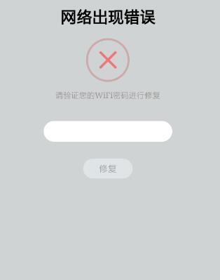

# ESP_Fishing
# 视频展示 https://www.bilibili.com/video/BV1154y1a76m/
## 编译版本下载 https://github.com/bilibilifmk/ESP_Fishing/releases
# 说明
 ## ESP82266 自动化WiFi密码钓鱼

 * 需要使用魔改SDK 否则攻击帧会被SDK忽略 （SDK去群里下载吧 有时间上传网盘）
 * 基于wifi_link_tool库开发（给个Star呗）https://github.com/bilibilifmk/wifi_link_tool
 * 需要上传文件系统

## 免责声明
 * 1.本项目仅供验证与学习使用，请勿对他人恶意攻击
 * 2.对他人而已的进行攻击是违法行为
 * 3.本项目完全面免费开源
 * 4.禁止对该项目进行售卖！
 * 5.你的所有操作均与作者本人无关

 # 操作流程 
 ## 第一次使用

* 刷入固件或自行编译 由于需要魔改SDK 提供了魔改SDK 也提供了编译版 可直接刷入 请在发布页下载最新固件

* 第一次启动 请连接 ESP_Fishing 的WiFi 无密码

* 使用浏览器访问 6.6.6.6 进入操作后台

* 设置一个自己喜欢的SSID和密码 保存后自动重启 

## 进行钓鱼操作
* 连接 自己设定的wifi 
* 进入后台 
* 点击“点击进入自动化WiFi钓鱼配置” 
* 扫描网络 
* 选择攻击WiFi 
* 指示灯熄灭进入自动化流程 
* 当被攻击者输入 密码 
* 程序自动验证密码是否正确 不正确继续攻击 正确会保存 指示灯亮起 
* 连接回WiFi 进入后台 可在记录中看到wifi和密码

### 后台界面

### 选择界面

### 被攻击者看到界面

# 原理
* 对AP进行帧广播，让客户端误以为密码失效从而断开连接 对5GWiFi 无效
* 帧结构：  
  0xC0, 0x00,  
  0x00, 0x00,  
  0xFF, 0xFF, 0xFF, 0xFF, 0xFF, 0xFF,  
  0x00, 0x00, 0x00, 0x00, 0x00, 0x00,/*SSID  */  
  0x00, 0x00, 0x00, 0x00, 0x00, 0x00,/*SSSID */  
  0x00, 0x00,  
  0x01, 0x00  

* 8266　开出个被攻击的一样的无密码WIFI很容易就连入这个假WiFi
* 使用portal　认证协议　当被攻击者连接上会自动弹出钓鱼页　

